# Instalación de la CLI de IBM Cloud y plugins

## Documentación oficial

[Documentación oficial sobre la CLI de IBM](https://cloud.ibm.com/docs/cli)

[Instalación de la CLI](https://cloud.ibm.com/docs/cli?topic=cli-install-ibmcloud-cli)

[Instalación de plugins para la CLI](https://cloud.ibm.com/docs/cli?topic=cli-plug-ins)

### Instalación de forma gráfica desde un navegador

1. Descarga el paquete correspondiente desde [el repositorio oficial de GitHub de IBM](https://github.com/IBM-Cloud/ibm-cloud-cli-release/releases/)

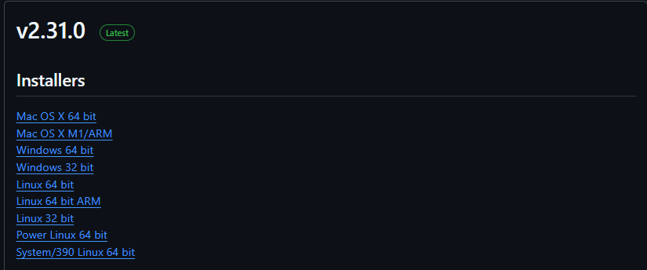

2. 
    - __MAC y Windows__ : Ejecutar el instalador
    - __Linux__ : Extraer el paquete y ejecutar el archivo `install`

### Instalación desde la Shell

- __*MAC*__ : `curl -fsSL https://clis.cloud.ibm.com/install/osx | sh`

- __*Linux*__ : `curl -fsSL https://clis.cloud.ibm.com/install/linux | sh` 

- __*Windows Powershell*__ : `iex (New-Object Net.WebClient).DownloadString('https://clis.cloud.ibm.com/install/powershell')`

### Autenticarse en la CLI de IBM mediante SSO

1. Ejecutar el siguiente comando : `ibmcloud login --sso`

    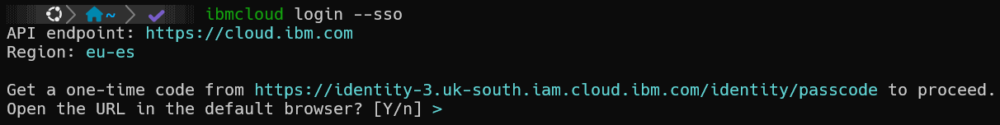

2. Seguir la URL especificada para obtener un código de inicio de sesión único

    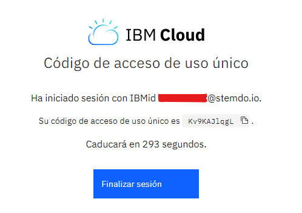

3. Pegamos el código 'SSO' en la Shell y vemos que la sesión se ha iniciado correctamente

    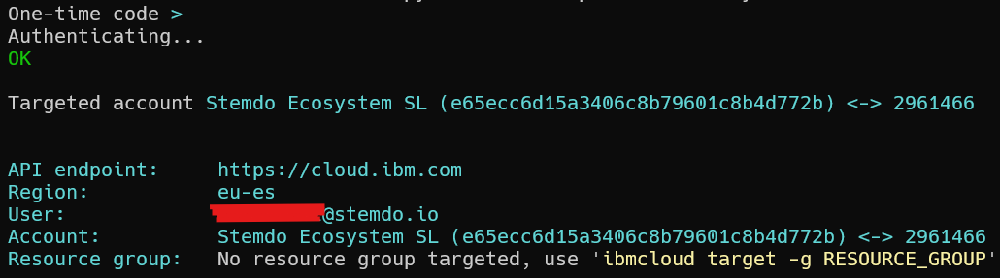

### Autenticarse en la CLI de IBM mediante API KEY

1. Generar la clave de API desde el portal de IBM

    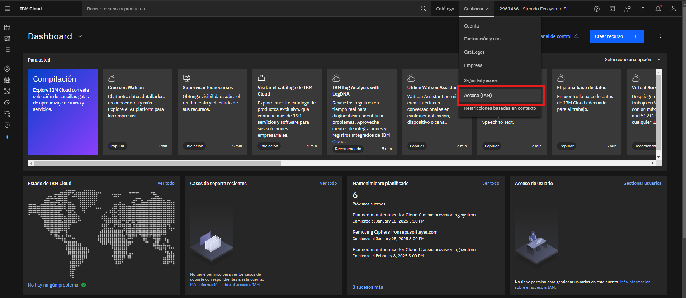

    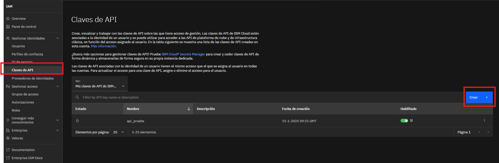

    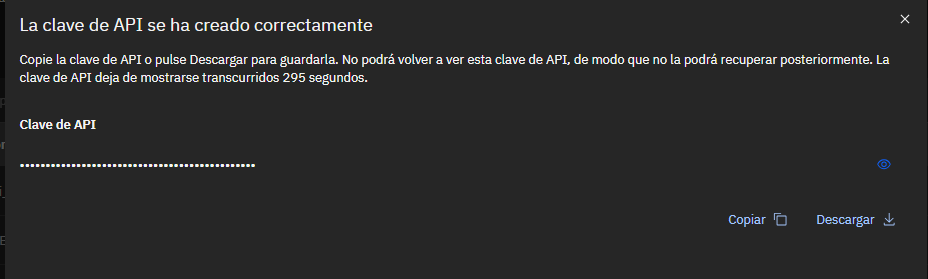

2. Iniciamos sesión con la clave de API mediante `ibmcloud login --apikey`

    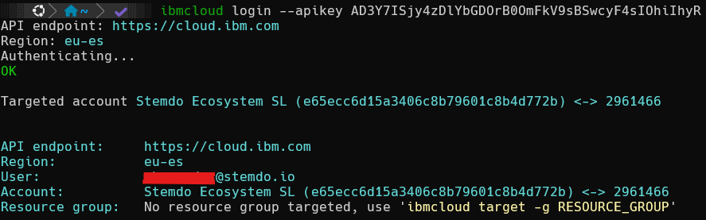

### Instalación de plugins para la CLI de IBM Cloud

1. Listamos todos los plugins disponibles en el repo `IBM Cloud` con el comando `ibmcloud plugin repo-plugins`

    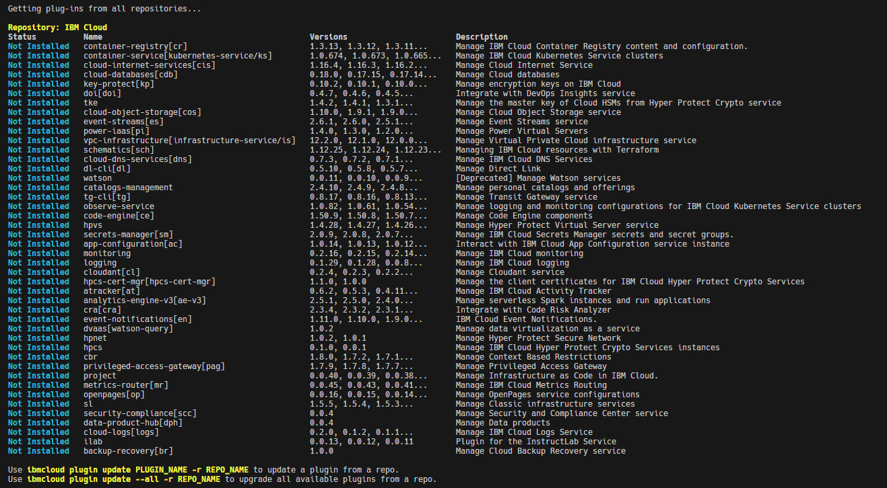

2. En este caso, vamos a instalar dos en concreto; `Container registry(cr)` y `Kubernetes Service(ks)`, lo haremos mediante `ibmcloud plugin install <NOMBRE_PLUGIN>`

    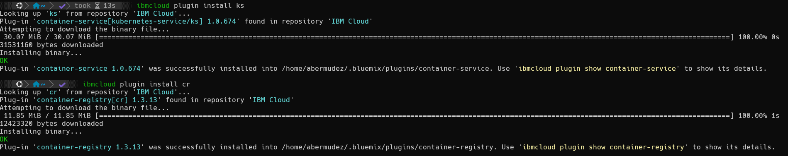

    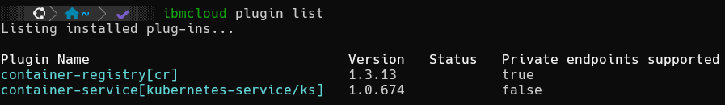

