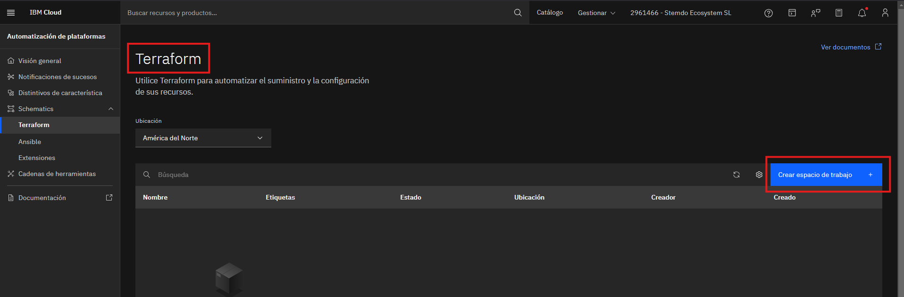
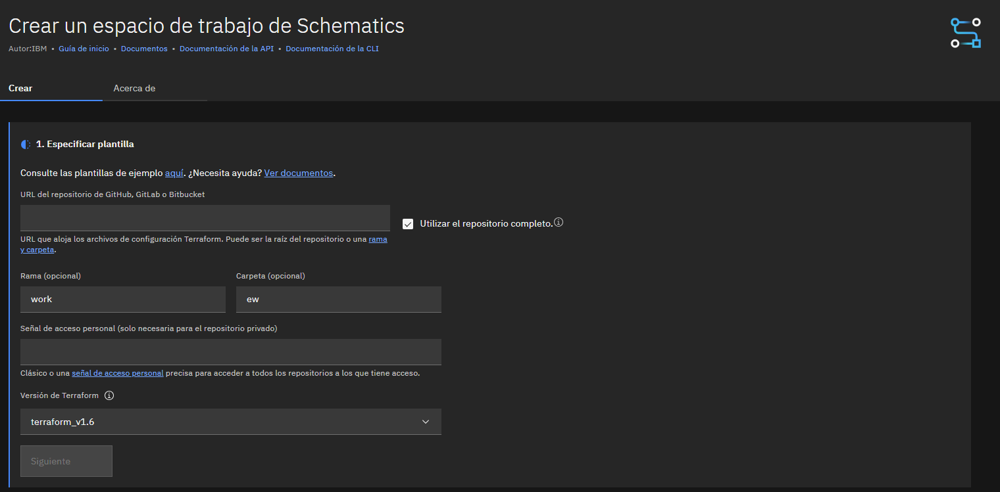
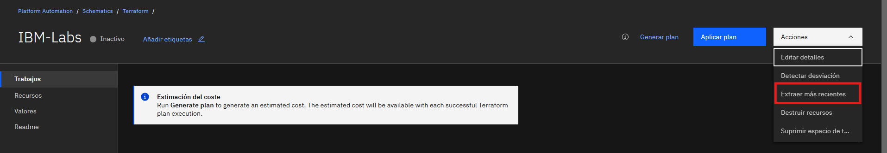
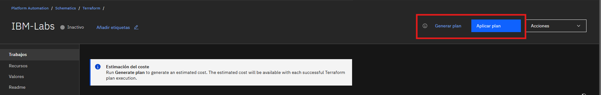
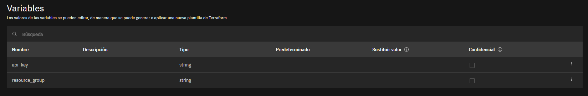
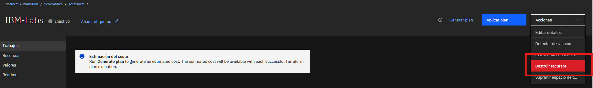

# Uso de IBM Schematics desde el portal web

Este documento te servirá de guía para saber cómo trabajar con Schematics desde el portal web de IBM.
Schematics es un servicio de IBM que permite desplegar recursos de Terraform o de Ansible desde una interfaz gráfica intuitiva y fácil de usar.

## Primeros pasos con Schematics

1. Accede al [portal web de IBM Cloud](https://cloud.ibm.com/).

2. En el catálogo, busca `'Schematics'`.

3. Crea un nuevo `'Workspace'` como se indica en la imagen. 

     

4. Configura todos los detalles del nuevo `'Workspace'` **_( Repositorio de github, rama, carpeta... )_**

    

## Recomendaciones sobre Schematics

> [!TIP] 
>  Recuerda siempre actualizar tu espacio de trabajo cuando hagas algún cambio en tus archivos de terraform.

  

> [!NOTE]
>  Estas dos opciones son las equivalentes a los comandos `terraform plan` y `terraform apply`.

  

> [!NOTE]
>  Puedes gestionar los valores de tus variables desde el apartado `'Valores'` en el menú de la izquierda.  Esta sección sustituye al archivo `'terraform.tfvars'`

  

> [!WARNING]
>   Recuerda siempre destruir tus recursos. Esta opción es equivalente al comando `terraform destroy`.

 
